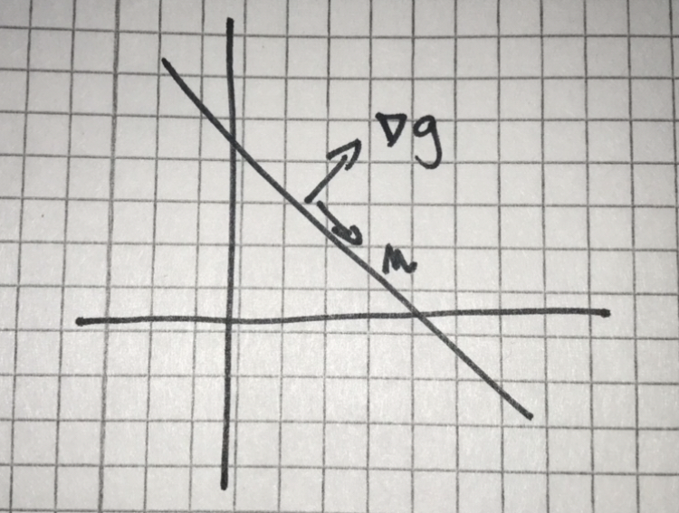

# Continuous Optimization

## info

files:
- examples.pdf
- solutions.pdf
- wormups.pdf
- notes.pdf

chapters of the book: 9, 10, 11, 12, 17

<b>TODO Download Matlab!!!</b>

## Lecture 1

### Th 1.1
If $f$ continuous in interval [a, b], then f has min (max) at some point x* where
- x* = a
- x* = b
- f'(x*) = 0
- f'(x*) doesn't exist

### Th 1.2
For $R^n$

$f:X->R,X\subseteq R^n$, X is compact

If $f$ continuous on $X$, then min(max) x* where
- at boundary $\delta X$
- where $\nabla f = 0$
- $\nabla f$ doesn't exist

### Th 1.3
$f:X->R$

x* global minimum if $f(x^*)\leq f(x)$ for each $x\subseteq X$

x* local minimum if $f(x^*)\leq f(x)$ for each $x\in X\cap N_\epsilon(x^*)$ for some $\epsilon > 0$

- $N_{\epsilon} (x^*) = \{x\in R^n: ||x - x^*|| < \epsilon\}$

<b>Global min => local min</b>

### Convex sets
$a,b \in X$, line segment between $a$ and $b$ in $X$
- line segment: $x = \lambda a + (1-\lambda)b$ where $0 \leq \lambda \leq 1$

### Convex functions
if $X$ convex, $f:X->R$ and $f(\lambda a + (1-\lambda)b) \leq \lambda f(a) + (1-\lambda)f(b)$ for all $a,b \in X$ and $0 \leq \lambda \leq 1$ then $f$ is convex on $X$

### protocol
If $f''$ continuous and $f'' \geq 0$ on interval in $R$ then $f$ is convex on the interval  

## Lecture 2

$P$ : min $(f(x))$

$x \in X$

Problem $P$ is convex if $f$ is convex function and $X$ is convex set

$n$ = 1
- Let $f$ continuous
- $f$ convex on an interval $X$ iff $f''(x) \geq 0$ on $X$

$n$ > 1
- Let $f$, $f'$, $f''$ continuous
- (Gradient, Hessian)
- Assuming $\frac{\delta ^2 f}{\delta x_i \delta x_j}$ are continuous, Hessian ($\nabla ^2 f$) is symmetric
    - $\frac{\delta ^2 f}{\delta x_i \delta x_j} = \frac{\delta ^2 f}{\delta x_j \delta x_i}$

### Taylor series

Around $x = a$

$f(x) = f(a) + f'(a)(x-a) + \frac{f''(a)}{2!} (x - a)^2 + ...$

$f(x) \approx P_2(x)$ quite a good approximation

Consider term $\frac{f''(a)}{2!} (x - a)^2$. First part constant, second curve.
- if $f''(a) \geq 0$ then convex (min)
- if $f''(a) \leq 0$ then concave (max)

$n > 1$

let $a = (a_1, a_2, ... , a_n)$

$f(x) \approx P_2(X) = f(a)+ \nabla \cdot f(a)^T (x -a) + \frac{1}{2} (x-a)^T \cdot \nabla ^2 f(a) \cdot (x-a)$
- gradient is a tangent plane

$n = 2$

$f(x = x_1^3 + x_2^2)$

$\nabla f = (3x_1^2, 2x_2)^T$

$\nabla ^2 f = \begin{pmatrix} 6x_1 &0 \\ 0 &2\end{pmatrix}$

$a = (1,1)$

$f(a) = 1^3 + 1^2 = 2$

$\nabla f(a) = (3, 2)^T$

$\nabla ^2 f = \begin{pmatrix} 6 &0 \\ 0 &2\end{pmatrix}$

First order approximation around $a = (1,1)$
- $P_1(x) = ... = -3 + 3x_1 + 2x_2$

Second order approximation around $a = (1,1)$
- $P_2(x) = ... = 1 - 3x_1 + 3x_1^2 + x_2^2$

Is it a good approximation? Pick points near and try to compute original and approximated, compare results.

The last term: $\frac{1}{2} (x-a)^T \cdot \nabla ^2 f(a) \cdot (x-a)$ gives you info about convexity/concavity 

### Def 2.1 (positive semidefinite)

An $n \times n$ matrix $H$ is called positive semidefinite if $v^T H v \geq 0$ for all vectors $v$

Function $f$ is convex

### Def 2.2 (positive definite)

$H$ is called positive definite if $v^THv >0$ for all vectors nonzero $v$

Function $f$ is strictly convex

### Th 2.3
(th 9.4 in the book)

$f_1(x), f_2(x), \cdots , f_n(x)$ are convex functions and $c_1, c_2, \cdots, c_n \geq 0$ then $f(x) = \sum{i = 1}^m c_i \cdot f_i$

### Th 2.4
(Th 9.5 in the book)

Assume continuous $\frac{\delta^2f}{\delta x_i \delta x_j}$ on convex set $X$ (hence $\nabla^2f$ symmetric)

$\nabla^2 f$ positive semidefinite on $X$ $\Leftrightarrow$ $f$ is convex on $X$

$\nabla^2 f$ positive definite on $X$ $\Rightarrow $ $f$ is strictly convex on $X$

### Th 2.5 (Eigenvalues)
(Th 9.6 in the book)

Let $\lambda_1, \lambda_2, ... , \lambda_n$ be the eingenvalues of a symmetric matrix $H$.

- $H$ is pos. semidef. $\Leftrightarrow \forall i : \lambda_i \geq 0$
- $H$ is pos. def. $\Leftrightarrow \forall i : \lambda_i > 0$
- $H$ is neg. semidef. $\Leftrightarrow \forall i : \lambda_i \leq 0$
- $H$ is neg. def. $\Leftrightarrow \forall i : \lambda_i <> 0$
- else $H$ is indefinite

### Th 2.6 (Sylvester's criterium)
$H$ is positive definite $\iff det(H_1) > 0, det(H_2) > 0, ... , det(H_n) > 0$

$H_i$ is the top $i \times i$ part of matrix $H$

### Th 2.7 (Sylvester's criterium for semidefinition)
$H$ is positive semidefinite $\Leftrightarrow$ all determinants of all principal minors are non-negative.
- principal minors are all matrices done by removing 0 to $n$ rows and columns (whole matrix to single numbers on diagonal)

### Th 2.8
$e^{f(x)}$ is convex if $f(x)$ is convex.

### Th 2.9
$X = \{x|g(x) \leq b\}$ is convex if the function $g(x)$ is convex

### Th 2.10
$X = X_1 \cap X_2 \cap \cdots \cap X_n$ is convex if all individual $X_i$ are convex

## Lecture 3

How to test that something is convex:
- prove that it is convex by theorem
- find point where the eigenvalues of Hessian are negative (at least one)

$f(x_1, x_2) = (x_1 - X_2^2)^2 + x_2^2$

We know that this is <b>not</b> convex.

$\nabla f(x) = (2x_1 - 2x_2^2, 2x_2 - 4x_1x_2 + 4x_2^3)^T$

$H = \nabla ^2 f(x) = \begin{pmatrix} 2 & -4x_2 \\ -4x_2 &2 -4x_1 +12x^2_2\end{pmatrix}$

Try different points:
- $x = (0,0) \rightarrow \lambda = 2,2$
- $x = (0,1) \rightarrow \lambda = 0.789, 15.21$
- $x = (1,0) \rightarrow \lambda = -2,2$

By theorem 9.5 (book), not convex since $\nabla ^2 f$ is not pos. semidef. at $x = (1,0)$

What happens at $x = (1,0)$?

1. Choose direction $(1,0)$

let $h(t) = f((1,0) + t(1,0))$ <i>#first brackets are point, t is length of a step, last brackets are direction</i> $ = (1+t)^2$ which is convex

2. Choose direction $(0,1)$

$h(t) = f((1,0) + t(0,1)) = 1 - t^2 + t^4$ which is <b>not</b> convex

$t = - 1/2$ gives $a = (1, -1/2)$

$t = 1/2$ gives $b = (1, 1/2)$

$\lambda = 1/2$ gives $x =  \lambda a + (1 - \lambda) b = (1, 0)$

$f(a) = f(b) = 0.8125, f((1,0)) = 1$

$f((1,0)) > \lambda f(a) + (1 - \lambda) f(b)$

$1 > 1/2 * 0.8125 + 1/2 * 0.8125$

Where in $R^2$ is $f$ convex?

Rather, where is $f$ strictly convex?
- Sylvester: check determinants of $H_1, H_2, \cdots, H_n$
- Strictly convex $\Leftrightarrow det(H_i) > 0$   $ \forall i$ 

$H_1 = (2)$
- $det(H_1) = 2 > 0$

$H_2 = H$
- $det(H_2) = 4 - 8x_1 + 8x_2^2 > 0$
- $8x_1 < 4 + 8x_2^2$
- $x_1 < 1/2 + x^2_2$

#### Clarification of Example 9.11 from the book

$f(x_1, x_2) = x_1^2 - x_1x_2$

Convex?

$\nabla ^2 f(x) = \begin{pmatrix} 2 & -1 \\ -1 & 0 \end{pmatrix}$

$\lambda = 1 \pm \sqrt 2 = 2.414, -0.414$
- one of the lambdas is negative

What happens if we restrict the function to $x_1 + x_2 = 1$?

$g(x) = x_1 + x_2$

$\nabla g = (1,1)^T$

$u^T \nabla g = 0$ (orthogonal)

$u = (1, -1)$

All points on the line can be written $x = x^0 + t \cdot u$ where $x^0$ on line.

$h(t) = f(x^0 + tu)$

$\nabla h = h'(t) = \frac{\delta f}{\delta x_1} \cdot u_1 + \frac{\delta f}{\delta x_2} \cdot u_2 = u^T \nabla f(x)$ 

$\nabla ^2 h = h''(t) = \frac{\delta ^2 f}{\delta x^2_1} \cdot u_1^2 + 2 \frac{\delta ^2 f}{\delta x_1x_2} \cdot u_1u_2 + \frac{\delta ^2 f}{\delta x^2_2} \cdot u_2^2 = u^T \cdot \nabla ^2 f \cdot u $

$= (1, -1) \begin{pmatrix} 2 & -1 \\ -1 & 0 \end{pmatrix} \begin{pmatrix} 1 \\ -1 \end{pmatrix} = (4) = 4 > 0$

strictly convex along line!!

#### Three dimentions

$f(x) = x_1^2 - 2x_1 + x_2^2 - x_3^2 + 4x_3$

$\nabla f = (-2 + 2x_1, 2x_2, 4- 2x_3)$

$\nabla ^2 f = \begin{pmatrix} 2 & 0 & 0 \\ 0 & 2 & 0 \\ 0 & 0 & -2 \end{pmatrix} \rightarrow$ not convex

$g(x) = x_1 - x_2 + 2x_3$

constraint $g(x) = 2, \nabla g = (1, -1, 2)^T$

solve $x_1 - x_2 + 2x_3 = 0$

$x_1 = x_2 - 2x_3$

$x_2 = x_2$

$x_3 = x_3$

$\begin{pmatrix} x_1 \\ x_2 \\ x_3 \end{pmatrix} = t_1 \begin{pmatrix} 1 \\ 1 \\ 0 \end{pmatrix} + t_2 \begin{pmatrix} -1 \\ 0 \\ 1 \end{pmatrix} $

$Z = \begin{pmatrix} 1 & -2 \\ 1 & 0 \\ 0 & 1 \end{pmatrix}$
- nullspace matrix for $A = (1, -1, 2)$ 

Suppose $Ax^0 = b$
- then all points where $Ax = 6$ can be written as $x = x^0 + Zt$

Reduced gradient:

$h(t) = f(x^0 + Zt)$

$\nabla h = Z^T \nabla f(x^0)$

Reduced hessian:

$\nabla ^2 h(t) = Z^T \nabla ^2 f(x^0)Z = \begin{pmatrix}1&1&0\\-2&0&1\end{pmatrix}\begin{pmatrix}2&0&0\\0&2&0\\0&0&-2\end{pmatrix}\begin{pmatrix}1&-2\\1&0\\0&1\end{pmatrix} = \begin{pmatrix}4&-4\\-4&6\end{pmatrix}$

$\lambda = 9.12, 0.88 > 0$

Hence convex!

### Th 3.1 (9.3)

Let $X = \{ x \in R^n : g(x) \leq b\}$ where $g(x)$ is convex function and $b$ is constant. Then $X$ is convex.

$X$ called sublevel set.

### Th 3.2 (9.2)

Let $X_1, X_2, \cdots, X_m$ be convex sets in $R^n$. Then $X = X_1 \cap X_2 \cap \cdots \cap X_m$ is a convex set

Ex:

$g(x) = x^2$

$X = \{ x \in R : x^2 \leq 1\}$

$g'(x) = 2x$

$g''(x) = 2 \geq 0$

$g$ is convex, hence $X$ is convex

$X = \{ x \in R : x^2 \leq -1\} = \emptyset$ (convex)

$X = \{ x \in R : x^2 \geq 1\}$ complement of set no.1

$X = (- \infty, -1] \cup [1, \infty)$ not convex

Our sets will usually look like this:

$X = \{ x \in R : g_1(x) \leq b_1, g_2(x) \leq b_2, \cdots, g_m(x) \leq b_m \} = \{ x \in R : g_1(x) \leq b_1 \cap g_2(x) \leq b_2 \cap \cdots \cap g_m(x) \leq b_m \}$

$X$ convex if $g_1 \cdots g_m$ convex. 

## Lecture 5

### Thm:
$X = R^n$ unconstrained doen'st have to have a minimum (no boundary)

If $f$ has a minimum and $f$ differenciable ($\nabla f$ exists) then it is at a stationary point ($\nabla f(x^0) = 0)

### Thm:

If $f$ convex and differentiable and $\nabla f(x^0) = 0$ then $x^0$ is a minimum

### Thm:

If $x^0$ is a point where the hessian $\nabla^2 f(x^0)$ is positive definite and $\nabla f(x^0) = 0$ then $x^0$ is a local minimum.

### Steepest descent:

Find $x^n$ where $\nabla f(x^n) = 0$

Pick a point $x^0$ and move in the direction $u = - \frac{\nabla f(x^0)}{|| \nabla f(x^0)||}$

Gives $h(t) = f(x^0 + tu)$, find minimum $z^*$

**New point:**

- $x^1 := x^0 + t^0u$

Stop when $||\nabla f(x^n)|| < \epsilon$

### Newton method:

$f: R^n \rightarrow R$

Approximate $f(x)$ with 2nd degree Taylor-polynomial $P_2(x)$

Solve: $\nabla P_2(x) = 0$

- Pick starting pouint $x^0$

$f(x) \approx P_2(x) = f(x^0) + \nabla f(x^0)^T \cdot (x - x^0) + 1/2 (x - x^0) ^T \cdot \nabla ^2 f(x^0) \cdot (x-x^0)$

Minimum of $P_2(x)$ expected at $\nabla P_2(x) = 0$

- Make a derivative of the above

$\nabla P_2(x) = \nabla f(x^0) + \nabla ^2 f(x^0) \cdot (x - x^0) = 0$ (zero vector)

Solve: $b + Ax = 0 \rightarrow Ax = -b \rightarrow x = A^{-1} (-b)$

- $\nabla ^2 f(x^0) \cdot (x - x^0) = - \nabla f(x^0)$
- $x = x^0 + (\nabla ^2 f(x^0))^{-1} (- \nabla f(x^0))$
- $x$ is a new point, where $\nabla P_2(x) = 0$, possibly $\nabla f(x)$ is close to $0$.

In Matlab we can solve $Ax = b$ faster directly. (Not by solving $x = A^{-1}b$ but by a command `x = A\b`)

- $u = \nabla ^2 f(x^0) \setminus (- \nabla f(x^0))$
- $x = x^0 + u$ (Newton's method with step length 1)

### Newton's modified method:

let $u = \nabla ^2 f(x^0) \setminus (- \nabla f (x^0))$

let $h(t) = f(x^0 + tu)$

solve $t^* = argmin(h(t))$ for $t \geq 0$

New point:
- $x^1 := x^0 + t^*u$

### Metods for 1D minima

$f: R \rightarrow R$

Interval halving: for *unimodal* $f$.

- An unimodal function is decreasing and then increasing.
    - Weaker than being convex

Pick an interval $[a,b]$ containing $x^*$ (minimum), where function $f$ is unimodal on that interval. Pick an $\epsilon > 0$.

$x^0 := \frac{a+b}{2}$

Compare $f(x^0)$ and $f(x^0 + \epsilon)$

if $f(x^0) > f(x^0 + \epsilon)$:
- $f$ is decreasing at $x^0$
- update $a$:
    - $a:=x^0$

elif $f(x^0) \leq f(x^0 + \epsilon)$:
- $f$ increasing
- update $b$:
    - $b:=x^0$

### Fun problem!

Given two curves:

What is the distance between the curves?

$C_1 = \{(x,y) \in R^2 : y = k \cdot x\}$

$C_2 = \{(x,y) \in R^2 : y = x^2 + l\}$

$dist(C_1, C_2) = min(||p-q||)$ where $p \in C_1, q \in C_2$

Convex problem if $C_1, C_2$ are convex sets, but $C_2$ is not convex.

Take $p \in C_1, q \in C_2$

$p = (p_1, p_2) = (p_1, k \cdot p_1) \in C_1$

$q = (q_1, q_2) = (q_1, q_1^2 + l) \in C_2$

$||p - q|| = \sqrt{(p_1 - q_1)^2 + (k \cdot p_1 - q_1^2 - l)^2}$

- Parameters ($k,l$) are fixed for this problem instance.
- Variables ($p_1, q_1$) are changed until we find their "best" values.

Solve:
- $min(||p_1 - q_1||)$
- $(p_1,q_1)^* = argmin(||p_1 - q_1||)$

Distance between functions is the distance between optimal points.

**Usually better to minimaze** $||p-q||^2$

## Lecture 6

### Problem: 

Constrained optimization

$f: R^n \rightarrow R$

$min(f(x))$

$x \in X$

$X = \{ x \in R^n: g_i(x) \geq b_1, \cdots, g_m(x) \geq b_m \}$

The above Probelm is a standard form for minimization problems.

The Problem is convex if $f$ convex on a convex set $X$.

*Recall: if all $g_i$ are concave on $R^n$ then $X$ is convex set.*

### Thm 11.3

If Problem is a convex problem and $x^*$ is a KKT-point, then $x^*$ is a minimum of the Problem.

## Def: KKT conditions (Karush, Kuhn, Tucker)

$x$ is a KKT-point if there is a point $v \in R^n$ such that:

for $i = 1, \cdots, m$:
1. $\nabla f(x) = \sum^m_{i=1}{v_i \nabla g_i(x)}$
2. $v_i \geq 0$
3. $g_i(x) \geq b_i$
4. $v_i(b_i - g_i(x)) = 0$

$1,2 \rightarrow$ dual feasibility

$v_i \rightarrow$ multiplicators, dual variables

$3 \rightarrow$ primal feasibility, $x \in X$

$4 \rightarrow$ complementarity

$f: R^2 \rightarrow R$

$min(f(x)) = x^2$

$g(x) = x_2 \geq 0$

Let our minimum be on the edge of the set, where $f(x) = 0$

$\nabla f(x) = (0,1)^T$

$\nabla g(x) = (0,1)^T$

Gradients are parallel. We have minimum.

$f: R^2 \rightarrow R$

$min(f(x)) = x_2$

$g(x) = x_1 + x_2 \geq 0$

Let our minimum be at $f((0,0))$, where $f(x) = 0$

$\nabla f(x) = (0,1)^T$

$\nabla g(x) = (1,1)^T$

There are possible directions which decrease value of $f(x)$

$x^0 = (0,0)^T$ feasible $x^0 \in X$

$u = (1, -1)^T$ feasible descent direction

$x = x^0 + tu = \begin{pmatrix}0 \\ 0\end{pmatrix} + t \begin{pmatrix}1\\-1\end{pmatrix} = \begin{pmatrix}t\\-t\end{pmatrix}, t \geq 0$

$g(x) = t + (-t) = 0 \geq 0$ ($x$ feasible, $t \geq 0$)

$f(x) = -t$

$f(x^0) = 0, f(1,-1) = -1$

$min(f(x)) = - \infin$

Feasible descent direction:

If $x^0 \in X$ and $f(x^0 + \epsilon u) < f(x^0)$ for some $\epsilon > 0$ and $x^0 + tu \in X$ for all $0 \leq t \leq \epsilon$, then we say $u$ is *feasible descent direction*.

If $x^0$ has a *fdd*, then we know that $x^0$ is not a minimum.

If there is no *fdd* at $x^0$, then *maybe* $x^0$ is a minimum.

$f: R^2 \rightarrow R$

$min(f(x)) = x_2$

$g_1(x) = x_1 + x_2 \geq 0$

$g_1(x) = -x_1 + x_2 \geq 0$

$\nabla f(x) = (0,1)^T$

$\nabla g(x) = (1,1)^T$

$\nabla g(x) = (-1,1)^T$

(Region is an absolute value of $x_2$)

Cone of vectors $u^1, u^2$ are all vectors on the form $w = c_1u^1 + c_2u^2$ where $c_1 \geq 0, c_2 \geq 0$

The first and second condition - you can write $\nabla f$ as a linear combination of the conditions $\rightarrow$ the $\nabla f$ is in the cone of $\nabla g_i$

$\nabla f = c_1 \nabla g_1 + c_2 \nabla g_2$

$(0,1)^T = c_1 (1,1)^T + c_2 (-1,1)^T$

$c_1 = 1/2, c_2 = 1/2$

$f: R^2 \rightarrow R$

$min(f(x)) = x_2$

$g_1(x) = x_1 + x_2 \geq 0$

$g_1(x) = x_1 + 2x_2 \geq 0$

$\nabla f(x) = (0,1)^T$

$\nabla g(x) = (1,1)^T$

$\nabla g(x) = (1,2)^T$

(Region is a cone to the side, $\nabla f$ not in the cone.)

Is $\nabla f$ in the cone of $\nabla g_1, \nabla g_2$?

solve:

$\begin{pmatrix}1&1&|&0\\1&2&|&1\end{pmatrix}$

gives $c_1 = -1 < 0, c_2 = 1 \geq 0 \rightarrow$ Not in the cone!

In fact, at $x^0 = (0,0)^T, u (2, -1)^T$ is a *fdd*. $x = x^0 + tu = (2t, -t)^T, t \geq 0$ and $f(x) = -t < 0$ if $t > 0$

$g_1(x) = t \geq 0$

$g_2(x) = 0 \geq 0$

### Linear problems

#### LP:
$min(f(x)) = c^Tx$

$Ax \geq b$

$x \geq 0$

#### LP-dual:
$max(h(v) = b^Tv$

$A^Tv \leq c$

$v \geq 0$

$A = m \times n$ matrix, $A = (a_{i,j})_{m \times n}$

ith row of $Ax \geq b$ means$

$g_i(x) = \sum^n_{j = 1}{a_{ij}x_j \geq b_i}$

$A = \begin{pmatrix}\nabla g_1^T \\ \cdots \\ \nabla g_m^T \end{pmatrix}$ (rows)

$A^T = (\nabla g_1, \cdots, \nabla g_m)$ (columns)

### Thm 6.2

If $x^*, v^*$ are feasible solutions and $f(x^*) = h(v^*)$ then $x^*, v^*$ are optimal!

weak duality:

$h(v^*) = b^Tv^* \leq (Ax^*)^Tv^* = (X^*)^TA^Tv^* \leq (x^*)^Tc = c^Tx^* = f(x^*)$

$h(v^*) = f(x^*)$ means $Ax^* - b, A^Tv^* - c$

so $A^Tv^* = \sum^m_{i = 1}{v_i^* \nabla g_i} = c = \nabla f$

*See also thm 6.5 - about complementarity*

$f: R^2 \rightarrow R$

$min(f(x)) = x_2$

$g_1(x) = x_2 - x_1^2 \geq 0$

$\nabla f(x) = (0,1)^T$

$\nabla g(x) = (-2x,1)^T$

(Region above $x_1^2$)

At point $x^0 = (1,1)$:

- $\nabla g(x^0) = (-2,1)$
- $\nabla f$ is not in the cone (not parallel) $\rightarrow$ there is a *fdd* (e.g. $u = (-1,-1)^T$)
- our $x^0$ moved to $x^0 = (0,0)$
- $\nabla g = (0,1)$
- $\nabla f = 1 \cdot \nabla g$ ("in the cone")
No *fdd*, $x^0$ is mayble minimum.

$g(x^0) = 0 - 0^2 = 0 \geq 0$ (3. point)

$1(0 - 0) = 0$ (4. point)

#### Example that it doesn't work

$f: R^2 \rightarrow R$

$min(f(x)) = x_2$

$g_1(x) = x_2 + x_1^2 \geq 0$

$\nabla f(x) = (0,1)^T$

$\nabla g(x) = (2x,1)^T$

(Region above $- x_1^2$)

at $x^0$ we get $\nabla g = (0,1)$

$\nabla f = 1 \nabla g$ (in the cone)

$g(x^0) = 0 \geq 0$ (3. point)

$1 (0 - g(x^0)) = 0$ (4. point)

**But not a minimum!**

no *fdd* because we have to move along the curve to find the minimum.

**If the set not convex, KKT conditions stop working!**

## Lecture 7

Plane in $R^3$

$X = \{ x \in R^3 : 3x_1 + 4x_2 + 5x_3 = 6\}$

Which point in $X$ is nearest the origin? Distance?

*Set it up as optimization problem!*

$min(f(x)) = ||x||^2 = x^Tx = \sum^n_ix_i^2$

$x \in X = \{x \in R^3 : a^Tx=b\}$ where $a = (3,4,5)^T$

The problem is convex, look for a *KKT* point

Look fo rthe gradient:

$\nabla f(x) = (2x_1, \cdots, 2x_n)^T = 2x$

$\nabla g(x) = a$ (Vector of serivations with respect to $x_i$)

$\nabla f(x) = v \cdot \nabla g(x)$

$2x = v \cdot a$ hence $x = v/2 \cdot a$

hence $a^Tx = v/2 \cdot a^Ta = b$

$v = \frac{2b}{a^Ta} = \frac{2b}{||a||^2}$

$x* =  \frac{b \cdot a}{a^Ta}$

after some computations the distance is $\frac{|b|}{||a||}$

for $a = (3,4,5), b = 6$ we get $\frac{6}{\sqrt{3^2 + 4^2 + 5^2}} = \frac{3\sqrt2}{5}$

### Another problem

$min(f(x)) = x_1^2 + x_2^2$

$g(x) = -(x_1 -1)^2 + x_2 - 1 \geq 0$ (feasible set above parabola)

$\nabla f(x) = (2x_1, 2x_2)^T$

$\nabla g(x) = (-2x_1 + 2, 1)^T$

KKT:

$\nabla f(x) = v \cdot \nabla g(x), v \geq 0$

$2x_1 = v(-2x_1 + 2)$
$2x_2 = v$

$x_1 = \frac{v}{v + 1}$
$x_2 = \frac{v}{2}$

We still need the fourth condition:

$v \cdot g(x) = v \cdot (-(\frac{v}{v+1}-1)^2 + \frac{v}{2} - 1) = \frac{v}{2(v+1)^2}(v^3-3v-4) = 0$

Easy would be $v = 0$, but that would give $x = (0,0) \notin X$

$v^3-3v-4 = 0$

Only one solution at $v^* \approx 2.19582$ which gives $x^* \approx (0.687, 1.098)$ and $f(x^*) \approx 1.6775$

**Need to verify conditions before claiming it's true**

$\rightarrow$ Now include constraint $-x_1 + x_2 \geq -1$. The minimum should be $f(x^*) = 11- 4\sqrt 5$

### Another one

Lets say the problem is convex

$x^0$ is *KKT* point $\Rightarrow x^0$ is minimum

$x^0$ is not minimum $\Rightarrow x^0$ not *KKT*

But it isn't true that: $x^0$ is minimum $\Rightarrow x^0$ is *KKT*

$min(f(x)) = x_2$

$g(x) = -x_2^2 \geq 0, (x_2^2 \leq 0)$

$\nabla f = (0,1)^T$

$\nabla g = (0, -2x_2)^T$

Any point in $X$ is on the form $(X_1, 0)$

so for $\nabla g = (0,0)^T$ there is no solution, no *KKT* point, all points in $X_1$ give a minimum

#### Two problems:
- vanishing $\nabla g$ at $x^0 \rightarrow \nabla g = 0$
- can not make costraint inactive

This problem can be "fixed" by rewriting constraint as $x_2 = 0$ or $x_2 \geq 0$

### Def: Slater's condition

We say that problem satisfies Slater's condition if there is a point $x \in X$ where all inequality constraints are inactive. That is all constraints $g_i(x) \geq b_i$ are strict inequalities: $g_i(x) > b_i$. Equality constraints can do whatever.

Say problem is convex. Assume $x^0$ is minimum and Slater's condition holds and all active constraints at $x^0$ have non-zero gradient $(\nabla g_i (x^0) \neq 0)$, then $x^0$ is a *KKT* point

**Testing $x^0$:**

Assume problem convex, Slater's condition holds, $\nabla g(x^0) \neq 0$ for active constraints. If $x^0$ is not *KKT*, then $x^0$ is not a minimum.

### Thm 11.2

No assumption of convexity!!

Assume $x^0$ is a regular point, that is, all the active constraints at $x^0$ have lineary independent gradients. If $x^0$ is not a *KKT* point, then $x^0$ is not a local minimum.

### General sufficient condition for a local minimum: 

(no convexity assumed) Assume $x^0 \in R^n$ has $n$ active constraints with positive dual values (not degenerate) and their gradients are lineary independent.

If $x^0$ is *KKT* then $x^0$ is local minimum

### The theorem:

Assume $f$ is convex and $g_i$ are concave ($i = 1, \cdots, m$) over $R^n$ and Slater's condition holds and $f$, $g_i$ have continuous derivatives.

$x^0$ is *KKT* point $\Leftrightarrow x^0$ is minimum.

### Nice little problem

$min(f(x)) = x_1$

$g_1(x) = x_2 \geq 0$

$g_2(x) = x_1^3 - x_2 \geq 0$

minimum is obviously in $x^* = (0,0)$

but what will go wrong?

$\nabla f = (1,0)$

$\nabla g_1 = (0,1)$

$\nabla g_2 = (0,-1)$

The conditions are satisfied, but not a *KKT* point

can't solve:

$(1,0) = v_1(0,1) + v_2(0,-1)$

NOT CONVEX!!

.

.

.

.

.

